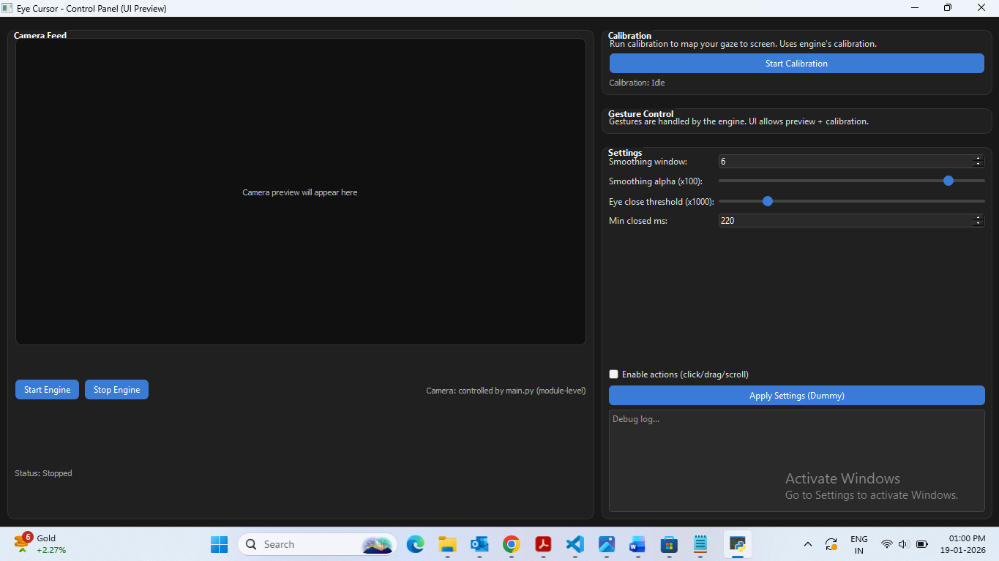

# 👁️ EyeCursor – Eye Tracking Based Cursor Control System

EyeCursor is a real-time eye tracking–based desktop application that enables hands-free cursor control using a webcam and offline voice commands.  
The system is designed as an assistive technology and a human–computer interaction project, focusing on accuracy, stability, and usability.

---

## 🚀 Features

- 🎥 **Live Camera Feed**
  - Real-time eye detection and gaze tracking
  - Smooth cursor movement with reduced jitter

- 🎯 **Calibration Module**
  - User-specific gaze calibration
  - Improves screen-wide cursor accuracy

- ⚙️ **Settings Panel**
  - Adjustable sensitivity and smoothing parameters
  - UI customization options

- 📜 **Logs Section**
  - System activity and event logging
  - Helpful for debugging and analysis

- 👁️ **Blink Detection**
  - Detects eye blinks for interaction control
  - Can be extended to support click actions

- 🧠 **Gaze Tracking & Smoothing**
  - Kalman filter–based smoothing
  - Eliminates sudden jumps and noise

- 🎙️ **Offline Voice Control**
  - Uses Vosk speech recognition
  - Works without internet connection

---

## 🛠️ Tech Stack

- **Language:** Python  
- **Computer Vision:** OpenCV  
- **Eye Tracking:** Custom gaze estimation logic  
- **Speech Recognition:** Vosk (offline)  
- **UI:** Python-based graphical interface  
- **Filtering:** Kalman Filter  
- **Libraries:** NumPy, PyAutoGUI  

---

## 📂 Project Structure

```text
EyeCursor/
│
├── src/
│   ├── main_with_ui.py        # Main entry point (RUN THIS FILE)
│   ├── main.py
│   ├── gaze_tracker.py
│   ├── blink_detection.py
│   ├── calibration.py
│   ├── kalman_filter.py
│   ├── smoothing.py
│   ├── voice_listener.py
│   ├── utils.py
│   ├── ui_settings.json
│   ├── calibration_data.json
│   └── models/
│       └── vosk-model-small-en-us-0.15/
│
├── docs/
├── tests/
├── requirements.txt
├── .gitignore
└── README.md
```
---

## ▶️ How to Run the Project
```bash
### 1️⃣ Clone the Repository

git clone https://github.com/ChikkannaS/EyeCursor.git
cd EyeCursor
2️⃣ Create Virtual Environment (Recommended)
bash
Copy code
python -m venv venv
venv\Scripts\activate
3️⃣ Install Dependencies
bash
Copy code
pip install -r requirements.txt
4️⃣ Run the Application
bash
Copy code
python src/main_with_ui.py
```
---

## 🖥️ Application Workflow
Running main_with_ui.py launches the EyeCursor UI

The UI contains four main sections:

Camera Feed – Displays live eye tracking

Calibration – Calibrates gaze for the user

Settings – Adjusts sensitivity and smoothing

Logs – Shows system events and status

Cursor movement is controlled using eye gaze

Voice commands provide additional control options

---

## 🧪 Use Cases

- Hands-free computer control
- Assistive technology for accessibility
- Human–computer interaction research
- Academic and learning projects

---

## 📸 Screenshots

### Main UI


### Calibration Screen


---

## 🔮 Future Enhancements

- Blink-based click actions
- Multi-monitor support
- MediaPipe-based gaze estimation
- AI-driven personalization
- Performance optimization

---

## 🎓 Academic & Placement Note

This project was developed as a **college academic project** and demonstrates:

- Real-time computer vision
- Modular Python architecture
- Signal smoothing and filtering
- Offline AI integration
